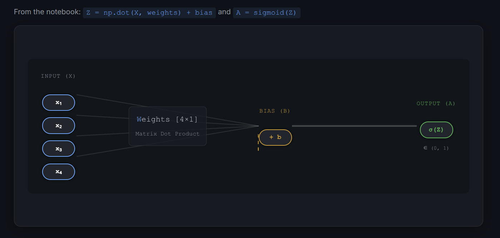

# MCDA5511 — Assignment 3: Neural Networks & Transformers

Notebook-based implementation and experimentation for feed-forward neural networks (FFNN) and transformer models.

## What this repository contains

- End-to-end experimentation in Jupyter notebooks.
- From-scratch model/training workflow for NN and transformer exercises.
- Space for datasets under [data/data.md](data/data.md) and generated artifacts under [output/results.md](output/results.md).

## Repository structure

```text
.
├── data/
│   └── data.md
├── output/
│   ├── neural_network_architecture.png
│   ├── transformer_encoder_architecture.svg
│   ├── transformers_training_loss.png
│   └── results.md
├── src/
│   ├── nn_transformers.ipynb
│   └── transformer_deprecated.ipynb
├── LICENSE
├── README.md
├── pyproject.toml
└── uv.lock
```

## Prerequisites

- Python 3.11+
- `uv` (recommended for dependency/environment management)

## Setup

From the project root:

1. Create/sync the environment:
	- `uv sync`
2. Start Jupyter:
	- `uv run jupyter lab`
	- or `uv run jupyter notebook`

## Run the assignment notebooks

Open and run notebooks in [src](src):

- [src/nn_transformers.ipynb](src/nn_transformers.ipynb)

Run cells top-to-bottom to reproduce training/evaluation outputs.

## Architecture diagrams

### Neural network (FFNN)



### Transformer encoder



## Data and outputs

- Place or document dataset details in [data/data.md](data/data.md).
- Save plots, tables, metrics, and notes in [output](output).

## Dependencies

Main dependencies are defined in [pyproject.toml](pyproject.toml), including:

- `torch`
- `numpy`
- `scikit-learn`
- `matplotlib`
- `seaborn`
- `plotly`
- `jupyterlab`

## Notes

- Keep notebooks deterministic where possible (set random seeds).
- If kernels are missing in Jupyter, rerun `uv sync` and restart Jupyter.
